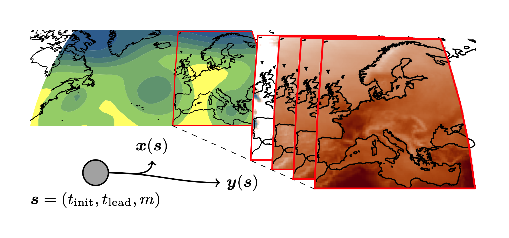

# What is *unseen-awg*?

*unseen-awg* is a model for generating spatio-temporal artificial weather data. It resamples a large dataset of historical weather forecasts (reforecasts).

The sampling happens in blocks of days; inspired by [1], we use the analog approach to minimize discontinuities between consecutive blocks of days. By making sure that the time series of large scale atmospheric circulation (left) doesn't have strong "jumps", also the impact-relevant variables like precipitation amounts, or temperature (right) are constrained to some extent.

Compared to other weather generators, *unseen-awg* has the strength that within each time step, dependencies between locations and variables are automatically captured well; we just do a temporal resampling of the underlying dataset.

[1] Yiou, P. AnaWEGE: a weather generator based on analogues of atmospheric circulation. Geosci. Model Dev. 7, 531–543 (2014), [https://doi.org/10.5194/gmd-7-531-2014](https://doi.org/10.5194/gmd-7-531-2014).